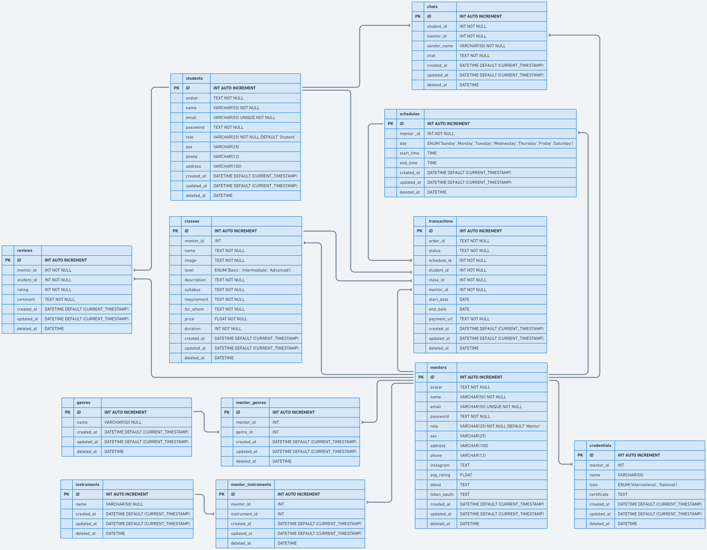

# MUSICLAB

<div align="center">
  <a href="https://github.com/orgs/group3-musiclab/repositories">
    
  </a>

  <p align="center">
    Capstone Program Immersive Alterra Academy
    <br />
    <a href="https://app.swaggerhub.com/apis-docs/KHARISMAJANUAR/MusicLab-API/1.0.0"><strong>| Open API Documentation |</strong></a>
    <br />
    <br />
  </p>
</div>

## 📑 About the Project

<p align="justify">MUSICLAB is an online web-app that used by user to find music teacher. There are many genres and instruments that will be available in this web-app. In this web-app User(Student) can book a music class depend on their choice and the Mentor can make their own music class after fill the credential. In order to make sure our app works well and following the requirements. We as a backend engineer build efficient and tested our systems.</p>

**Communication:**  


## 🛠 Technology Stack

<div align="center">

  </div>

# 🔗 ERD

<div align="center">

  </div>

# ⚡ Features

<details>
  <summary>🎫 Auth</summary>
  
| Method      | Endpoint            | Params      |q-Params            | JWT Token   | Function                                |
| ----------- | ------------------- | ----------- |--------------------| ----------- | --------------------------------------- |
| POST        | /register           | -           |-                   | NO         | Register a new User                |
| POST        | /login      | -           |-                   | NO         | Login to the system        |
  
</details>

<details>
  <summary>🎫 Google Oauth2</summary>
  
| Method      | Endpoint            | Params      |q-Params            | JWT Token   | Function                                |
| ----------- | ------------------- | ----------- |--------------------| ----------- | --------------------------------------- |
| POST        | /login/oauth           | -           |-                   | NO         | Login with google               |
| POST        | /oauth/create-event     | -           |-                   | NO         | Make event in google calender       |
  
</details>

<details>
  <summary>👨‍💼 Student</summary>
  
| Method      | Endpoint            | Params      |q-Params            | JWT Token   | Function                                |
| ----------- | ------------------- | ----------- |--------------------| ----------- | --------------------------------------- |
| GET        | /students/profile          | -           |-                   | YES         | Show Student Profile                 |
| PUT        | /students       | -           |-                   | YES         | Update Student Profile         |
| PUT        | /students/password             | -           |-                   | YES          | Update Student Password                    |
| DELETE         | /students          | -           |-                   | YES         | Deactivate Student                   |
  
</details>

<details>
  <summary>👩‍🏫 Mentor</summary>
  
| Method      | Endpoint            | Params      |q-Params            | JWT Token   | Function                                |
| ----------- | ------------------- | ----------- |--------------------| ----------- | --------------------------------------- |
| GET        | /mentors          | -           |name, genre, instrument, rating, qualification                  | NO        | Show All Mentor List   |
| GET        | /mentors/topweek       | -           |-                   | NO         | Show Top Week Mentor by Rating         |
| POST        | /mentors/credentials             | -           |-                   | YES          | Post Mentor Credential                    |
| GET         | /mentors/{mentor_id}          | mentor_id           |-                   | NO         | Show Detail Mentor                  |
| GET         | /mentors/profile          | -|-                   |YES         | Show Mentor Profile                  |
| PUT         | /mentors         | -           |-                   | YES         | Update Mentor Profile                 |
| PUT         | /mentors/password          | -           |-                   | YES         | Update Mentor Password                  |
| DELETE         | /mentors          | -           |-                   | YES         | Deactivate Mentor                   |
</details>

<details>
  <summary>🎸 Instrument</summary>
  
| Method      | Endpoint            | Params      |q-Params            | JWT Token   | Function                                |
| ----------- | ------------------- | ----------- |--------------------| ----------- | --------------------------------------- |
| GET        | /instruments          | -           |-                  | NO        | Show All Instrument List  |
| POST        | /mentors/instruments       | -           |-                   | YES         | Post Mentor Instrument         |
| GET        | /mentors/{mentor_id}/instruments            | mentor_id            |-                   | NO   | Show All Mentor Instrument by Mentor ID|
| DELETE         | /mentors/instruments/{instrument_id} | instrument_id      |-                   | YES        | Delete Mentor Instrument                 |
</details>

<details>
  <summary>🎵 Genre</summary>
  
| Method      | Endpoint            | Params      |q-Params            | JWT Token   | Function                                |
| ----------- | ------------------- | ----------- |--------------------| ----------- | --------------------------------------- |
| GET        | /genres          | -           |-                  | NO        | Show All Genre List  |
| POST        | /mentors/genres       | -           |-                   | YES         | Post Mentor Genre         |
| GET        | /mentors/{mentor_id}/genres            | mentor_id            |-                   | NO   | Show All Mentor Genre by Mentor ID|
| DELETE         | /mentors/genres/{genre_id} | genre_id      |-                   | YES        | Delete Mentor Genre                 |
</details>

<details>
  <summary>📃 Review</summary>
  
| Method      | Endpoint            | Params      |q-Params            | JWT Token   | Function                                |
| ----------- | ------------------- | ----------- |--------------------| ----------- | --------------------------------------- |
| POST        | /mentors/{mentor_id}/reviews       | mentor_id           |-                   | YES         | Make a Review in Mentor Class        |
| GET        | /mentors/{mentor_id}/reviews            | mentor_id            |-                   | NO   | Show All Mentor Mentor Review by Mentor ID|
</details>

<details>
  <summary>💬 Chat</summary>
  
| Method      | Endpoint            | Params      |q-Params            | JWT Token   | Function                                |
| ----------- | ------------------- | ----------- |--------------------| ----------- | --------------------------------------- |
| POST        | /chats       | -           |-                   | YES         | Send a Message        |
| GET        | /chats            | -            |student_id, mentor_id                  | YES   | GET a Chat by student_id or mentor_id|
  | GET        | /inbox            | -            |-                | YES   | Show All Chat List|
</details>

<details>
  <summary>📚 Class</summary>
  
| Method      | Endpoint            | Params      |q-Params            | JWT Token   | Function                                |
| ----------- | ------------------- | ----------- |--------------------| ----------- | --------------------------------------- |
| POST        | /mentors/class          | -           |-                  | YES        | Make a Class |
| GET        | /mentors/{mentor_id}/class        | mentor_id          |-                   | YES         | Get All Mentor Class by Mentor ID         |
| GET        | /class/{class_id}          | class_id            |-                   | YES   | Show Mentor Class Detail|
  | PUT        | /class/{class_id}          | class_id            |-                   | YES   | Update Mentor Class|
| DELETE         | /class/{class_id} | class_id      |-                   | YES        | Delete Mentor Class                 |
</details>

<details>
  <summary>📆 Schedule</summary>
  
| Method      | Endpoint            | Params      |q-Params            | JWT Token   | Function                                |
| ----------- | ------------------- | ----------- |--------------------| ----------- | --------------------------------------- |
| POST        | /mentors/schedules          | -           |-                  | YES        | Make a Class Schedule|
| GET        | /mentors/{mentor_id}/schedules        | mentor_id          |-                   | YES         | Get All Mentor Schedule by Mentor ID  |
| POST        | /schedules/{schedule_id}          | schedule_id            |-                   | YES   | Check Schedule Availability|
| DELETE         | /schedules/{schedule_id} | schedule_id      |-                   | YES        | Delete Mentor Class Schedule                 |
</details>

<details>
  <summary>💵 Transaction</summary>
  
| Method      | Endpoint            | Params      |q-Params            | JWT Token   | Function                                |
| ----------- | ------------------- | ----------- |--------------------| ----------- | --------------------------------------- |
| POST        | /transactions         | -           |-                  | YES        | Make a Transaction|
| GET        | /mentors/transactions       | -          |-                   | YES         | Get All Mentor Transaction  |
| GET        | /students/transactions       | -          |-                   | YES         | Get All Student Transaction  |
</details>

# 🛠️ How to Run Locally

- Clone it

```
$ git clone https://github.com/group3-musiclab/MusicLab-BE
```

- Go to directory

```
$ cd MusicLab-BE
```

- Run the project

```
$ go run .
```

- Voila! 🪄

# 🤖 Author

- Kharisma Januar Muhammad J N <br> [](https://github.com/kharismajanuar)
- Alif Muhamad Hafidz <br> [](https://github.com/AlifMuhamadHafidz)

<h5>
<p align="center">Built with ❤️ by MusicLab Team ©️ 2023</p>
</h5>
